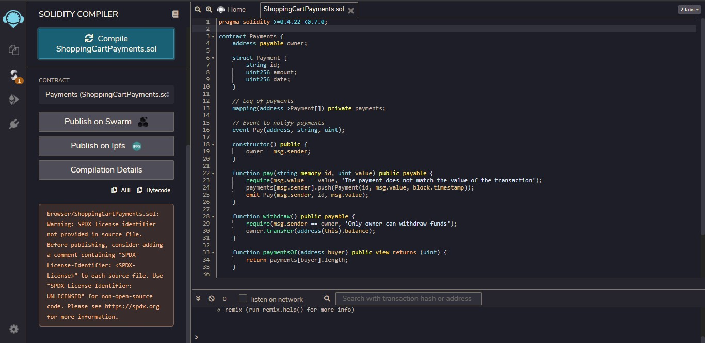
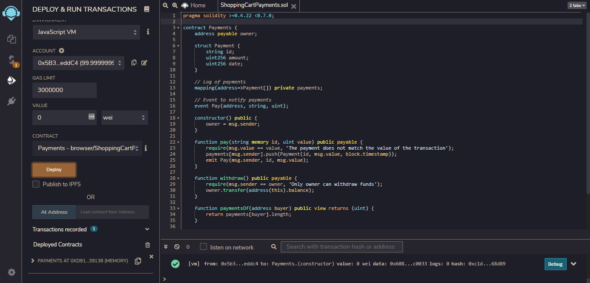
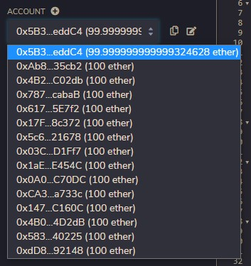
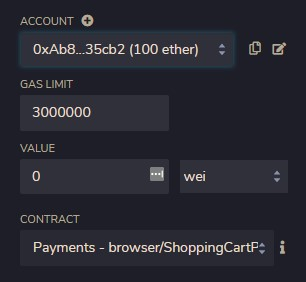
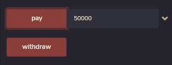
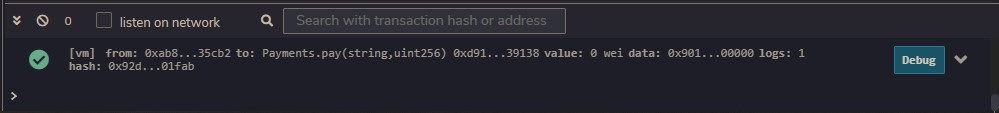
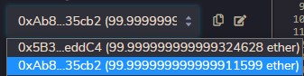
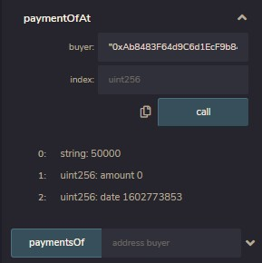
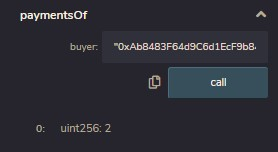

# shoppingCartTransaction
Blockchain assignment on shopping cart transaction.

# Code Info
 
The following code computes the payments from an account based on the shopping cart.
 

# Output
 
The code is executed in the online ide known as <a href="http://remix.ethereum.org/">Remix</a>.    

 
The code is compiled.    

 
The project is deployed.    

 
Accounts present.    

 
Initial state of the project. Second account is selected with a Gas limit of 3000000.    

 

 
Payment of 5000 is made.    

 
Changes of transaction reflected on the account.    

 
Payments made.    

 
Total number of tramsactions made so far.
